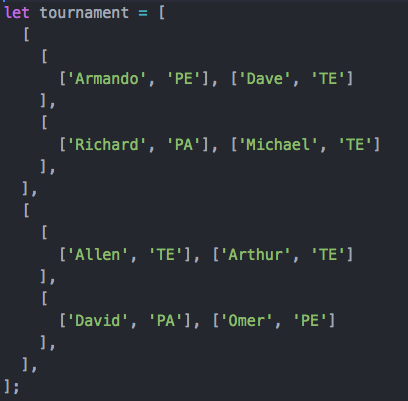

## Torneio

Um torneio de Pedra-Papel-Tesoura é representado por chaves. Cada chave pode ser composta por duas outras chaves ou um jogo. Exemplo:


  
  Nesse torneio exemplo, na primeira chave mais externa, Armando ganha de Dave, Michael ganha de Richard, sendo assim, Armando joga contra Michael e, por fim, Armando é o vencedor.

Da mesma forma, Allen ganha de Arthur, David ganha de Omer. Depois Allen ganha de David.

Finalmente, Armando ganha de Allen.

Escreva um método que aceita um torneio encodado como no exemplo acima e retorna o vencedor (No caso do exemplo, o retorno seria ["Armando", "PE"]). Você pode assumir que a entrada do método será bem formatada, ou seja, teremos sempre 2^n players.

```text

Exemplo:

function tournamentGameWinner(tournament) { // your code goes here...}let tournament = [ [ [ ['Armando', 'PE'], ['Dave', 'TE'] ], [ ['Richard', 'PA'], ['Michael', 'TE'] ], ], [ [ ['Allen', 'TE'], ['Arthur', 'TE'] ], [ ['David', 'PA'], ['Omer', 'PE'] ], ],];console.log(tournamentGameWinner(tournament))
```

**Resolução 1:**

```javascript
function rpsGameWinner(game) {
  if (game.length != 2) {
    throw new Error("WrongNumberOfPlayers");
  }
  if (
    !game[0][1].match(/\bPE\b|\bPA\b|\bTE\b/gi) ||
    !game[1][1].match(/\bPE\b|\bPA\b|\bTE\b/gi)
  ) {
    throw new Error("NoSuchStrategyError");
  } else {
    if (game[0][1] == game[1][1]) return game[0];
    if (game[0][1].toUpperCase() == "PA" && game[1][1].toUpperCase() == "PE")
      return game[0];
    if (game[0][1].toUpperCase() == "PE" && game[1][1].toUpperCase() == "TE")
      return game[0];
    if (game[0][1].toUpperCase() == "TE" && game[1][1].toUpperCase() == "PA")
      return game[0];
    return game[1];
  }
}

function tournamentGameWinner(tournament) {
  let players1 = tournament[0];
  let players2 = tournament[1];
  let winner1 = [];
  let winner2 = [];
  players1.forEach((el) => {
    winner1.push(rpsGameWinner(el));
    if (winner1.length != 1) {
      winner1 = rpsGameWinner(winner1);
    }
  });

  players2.forEach((el) => {
    winner2.push(rpsGameWinner(el));
    if (winner2.length != 1) {
      winner2 = rpsGameWinner(winner2);
    }
  });
  return rpsGameWinner([winner1, winner2]);
}
```
